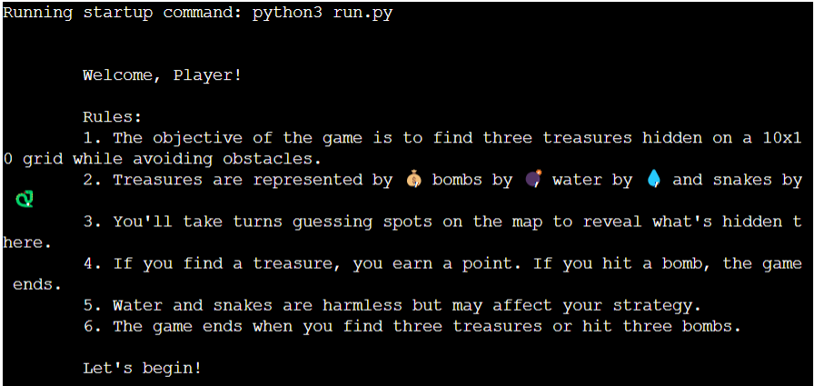
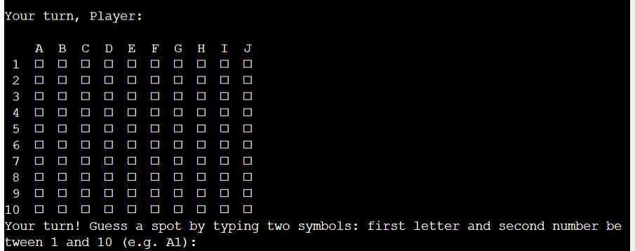
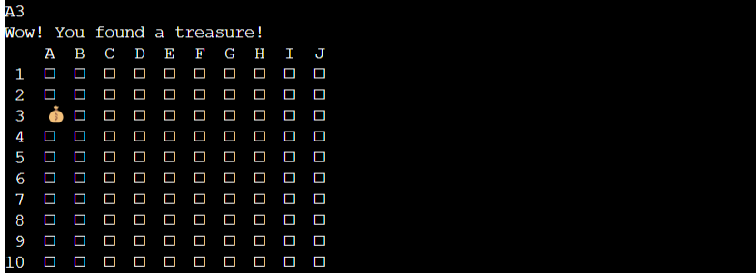
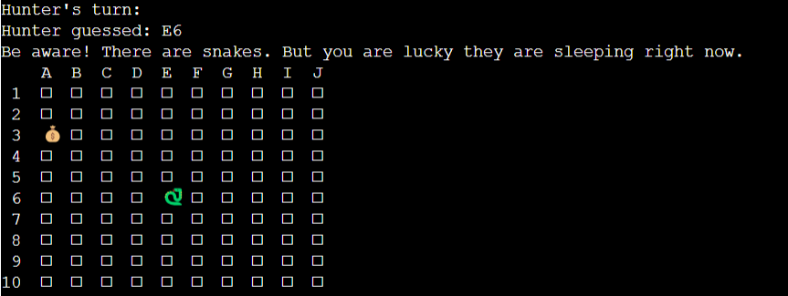
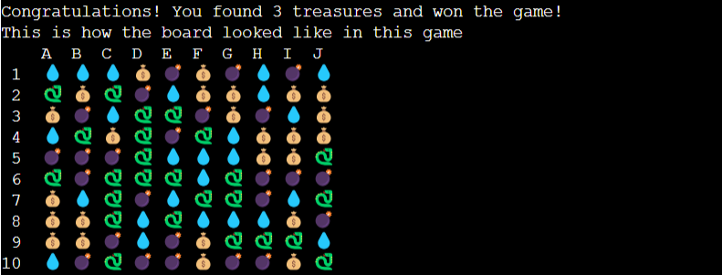
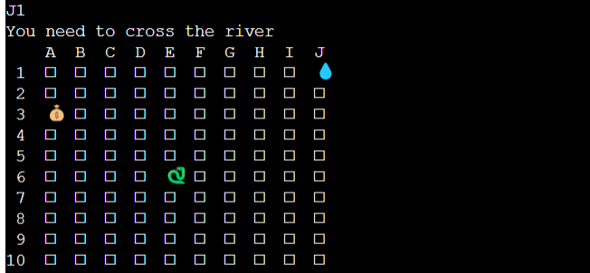
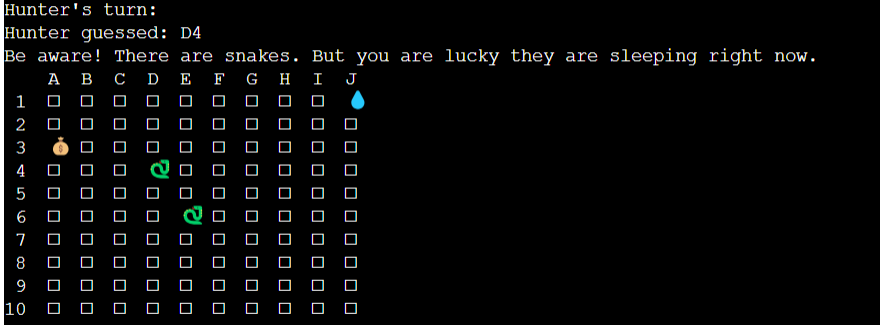
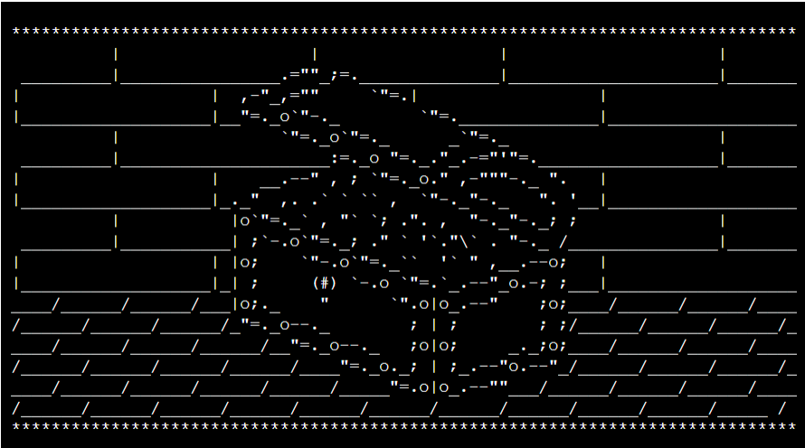
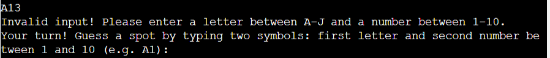
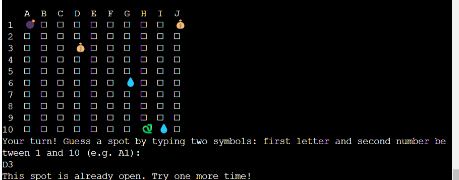

# Treasure Hunting

## Introduction
Treasure Hunting is an exciting adventure game where players embark on a quest to find hidden treasures. The game provides an immersive experience that combines exploration, strategy, and mystery. The Player has to Play with Computer, who is called Hunter.
You can try my game [here](https://hunting-for-treasure-8ec40df44500.herokuapp.com/)

## Table of Contents
1. [User Stories](#user-stories)
2. [Game Overview](#game-overview)
3. [Features](#features)
4. [Future Enhancements](#future-enhancements)
5. [Technologies Used](#technologies-used)
6. [Testing](#testing)
7. [Bugs](#bugs)
8. [Development and Deployment](#development-and-deployment)
9. [Credits](#credits)

## User Stories
As a player
A easy to play game, with easy instructions
See the board and every move
I want to be able to play the game again or quit easily

## Game Overview
In Treasure Hunting, players take on the role of adventurers who must navigate through various terrains and overcome obstacles to uncover hidden treasures. The game world is filled with clues, puzzles, and challenges that players must solve to progress.

The game starts by creating initial board.

If user finds a treasure he gets message indicating that.

Hunter takes trun every time after Player

When game is over the user can see how initial hidden board looked like

## Features
- **Exploration**: Players can explore diverse environments such as water,snakes, bombs, treasures.
When user hits water, he is offered to cross a river.

Sometimes he can hit snakes who are sleeping

If Player wins he gets a picture with winner treasure

At the end the Player is asked if he wants to play again.

- **Puzzles and Challenges**: Game tests problem-solving skills and intellect.
- **Leaderboards**: Compete with Hunter who is Computer for the highest treasure score.

## Future Enhancements
In future updates, the game could include:
- Multiplayer Mode: Introduce a multiplayer mode where players can team up or compete against each other.
- Expanded World: Expand the game world with new regions, landmarks, and hidden secrets to discover.

## Technologies Used
Treasure Hunting utilizes the following technologies:
- Python Programming Language: For coding game mechanics, logic, and interactions.

## Testing
The game undergoes rigorous testing to ensure:
- Gameplay mechanics function as intended without bugs or glitches.
- Controls are responsive and intuitive for players of all skill levels.
- Compatibility across different devices and platforms.
- Proper balancing of difficulty levels and progression.

I manually tested the code in this project giving invalid inputs and inputing fields which were already opened.

## Bugs
Known bugs and issues are actively monitored and addressed promptly to ensure a smooth gaming experience for players.
User input is always checked, and if necessary error message is diplayed.
User

If the User hits the spot which is already opened, he gets appropriate message indicating it.

Initially it would create board where some spots would be empty, but this bug was fixed so board is all filled with different symbols.

## Development and Deployment

This project was developed through Gitpod, using the template provided by Code Institute.

The deployment is made using Heroku following the listed steps:

Log in or register a new account on Heroku.
Click on 'New' in the dashboard and select 'Create New App'.
Select a uniquely name for the app and choose your region.
Click on "Create app".
When the app is created click on Setting.
To improve compatibility with various Python libraries add Config Var with Key = PORT and the Value = 8000.
Add 2 buildpacks: Python and then Nodejs in this specific order.
Go back at the top and click on "Deploy" and select "GitHub".
Scroll down and click on 'Connect to GitHub'.
Search for your GitHub repository name by typing it.
Click on "Connect".
Scroll down and click on "Deploy Branch".
You will see a message "The app was successfully deployed" when the app is built with python and all the depencencies.
Link to the deployed site https://hunting-for-treasure-8ec40df44500.herokuapp.com/

## Credits
Graphic picture for the winner with treasure was taken from https://trinket.io/python/e2f2419064 website. 
Special thanks to Code Institute for their contributions and support during development.
